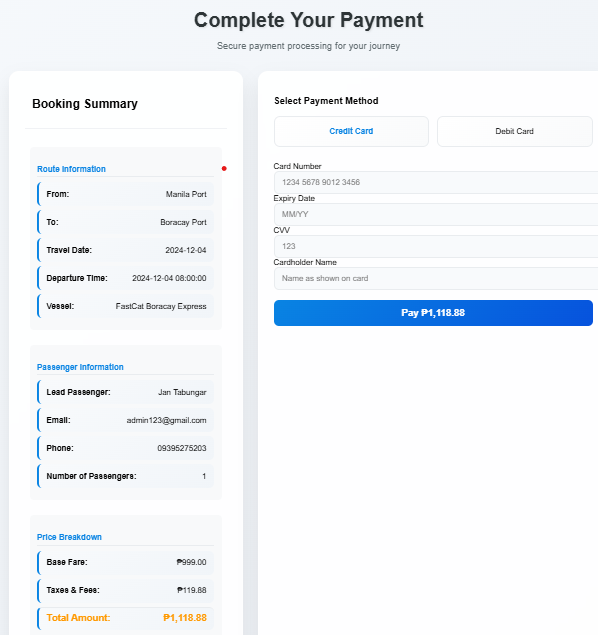

# Harbor Management System


## Overview
Harbor Management System is a comprehensive solution designed to streamline the management of harbor operations. This project is developed as part of the IM2 course.

## Table of Contents
- [Overview](#overview)
- [Features](#features)
- [Installation](#installation)
- [Usage](#usage)
- [Screenshots](#screenshots)
- [Contributing](#contributing)
- [Code of Conduct](#code-of-conduct)
- [Security](#security)
- [License](#license)
- [Group Members](#group-members)
- [Project Links](#project-links)

## Features
- Easy boat ticket booking
- Real-time availability and pricing
- Secure payment options
- Dedicated customer support

## Installation
To get started with the Harbor Management System, follow these steps:

1. Clone the repository:
    ```sh
    git clone https://github.com/yourusername/harbor-management-system.git
    ```
2. Navigate to the project directory:
    ```sh
    cd harbor-management-system
    ```
3. Install the dependencies:
    ```sh
    pip install -r requirements.txt
    ```
4. Apply migrations:
    ```sh
    python manage.py migrate
    ```
5. Run the development server:
    ```sh
    python manage.py runserver
    ```

## Usage
To use the Harbor Management System, open your web browser and navigate to `http://127.0.0.1:8000/`. From there, you can register, log in, and start managing harbor operations.

## Screenshots
### Home Page


### Booking Page


### About Page


### Payment Page


## Contributing
We welcome contributions to the Harbor Management System. To contribute, please follow these steps:

1. Fork the repository.
2. Create a new branch:
    ```sh
    git checkout -b feature/your-feature-name
    ```
3. Make your changes and commit them:
    ```sh
    git commit -m "Add your commit message"
    ```
4. Push to the branch:
    ```sh
    git push origin feature/your-feature-name
    ```
5. Open a pull request.

## Code of Conduct
Please read our [Code of Conduct](CODE_OF_CONDUCT.md) for details on our community standards.

## Security
If you discover any security vulnerabilities, please read our [Security Policy](SECURITY.MD) for instructions on how to report them.

## License
This project is licensed under the MIT License. See the [LICENSE](LICENSE) file for more details.

## Group Members
- Selma, John Edward L.
- Sapio, Gwyn M.
- Tabungar, Steven Jan M.

## Project Links
- [Gantt Chart](https://docs.google.com/spreadsheets/d/1BZLc6YBe8YeBp1ZcHK0x8M_s635Xkv3jfvOoUuHHc2o/edit?usp=sharing)
- [Harbor Hop Figma](https://www.figma.com/design/fEaKTxQBTnwbtAtaRXNcGy/Untitled?node-id=6-282&t=yUtDM0fuRE0mOHqU-1)
- [ERD](https://online.visual-paradigm.com/share.jsp?id=333630353838332d31#diagram:workspace=odcapejy&proj=0&id=1)
